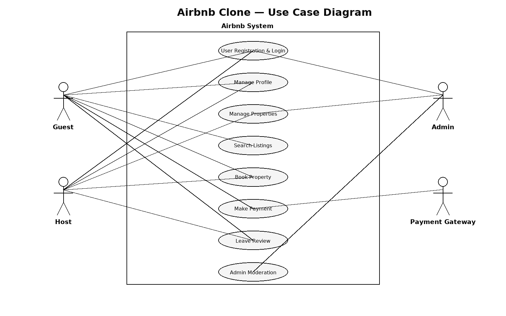

# Airbnb Clone – Use Case Diagram

This document presents a **Use Case Diagram** showing how different actors interact with the Airbnb Clone backend system.  
The diagram highlights **user registration, property management, booking, payments, and reviews**.

---

## 🎭 Actors
- **Guest** – A user who can register, search for properties, make bookings, and leave reviews.
- **Host** – A user who can register, list/manage properties, and view bookings.
- **Admin** – (Optional) Oversees the system, manages users, and resolves disputes.
- **Payment Service** – External system that processes payments.

---

## 📌 Key Use Cases
### Guest
- Register / Login
- Search properties
- Book a property
- Make payments
- Cancel booking
- Leave reviews
- Send messages to host

### Host
- Register / Login
- List property
- Manage property (update, delete)
- Manage availability
- View bookings
- Respond to messages
- Reply to reviews

### Admin (Optional)
- Manage users
- Manage properties
- Resolve disputes

### Payment Service
- Process payment
- Handle refunds

---

## 📊 Use Case Diagram
The diagram below illustrates how actors interact with the system.

---

## 📂 Repository Structure

